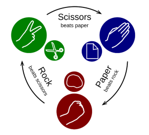

# Rock-Paper-Scissors Game 🎮

A simple console-based implementation of the classic **Rock, Paper, Scissors** game, written in **Python**.
## 🚀 How to Play
1. The game asks you to choose: **[r]ock**, **[p]aper**, or **[s]cissors**.
2. The computer randomly picks its move.
3. The winner is determined based on the classic rules:
   - Rock beats Scissors
   - Scissors beat Paper
   - Paper beats Rock

## 🕹️ Live Demo
Play the game here: [Rock-Paper-Scissors on Replit]  https://replit.com/@BarbutovB/RockPaperScissors

## 🛠️ Technologies Used
- Python 3
- Random module for computer moves

## 📄 License
This project is licensed under the MIT License.
